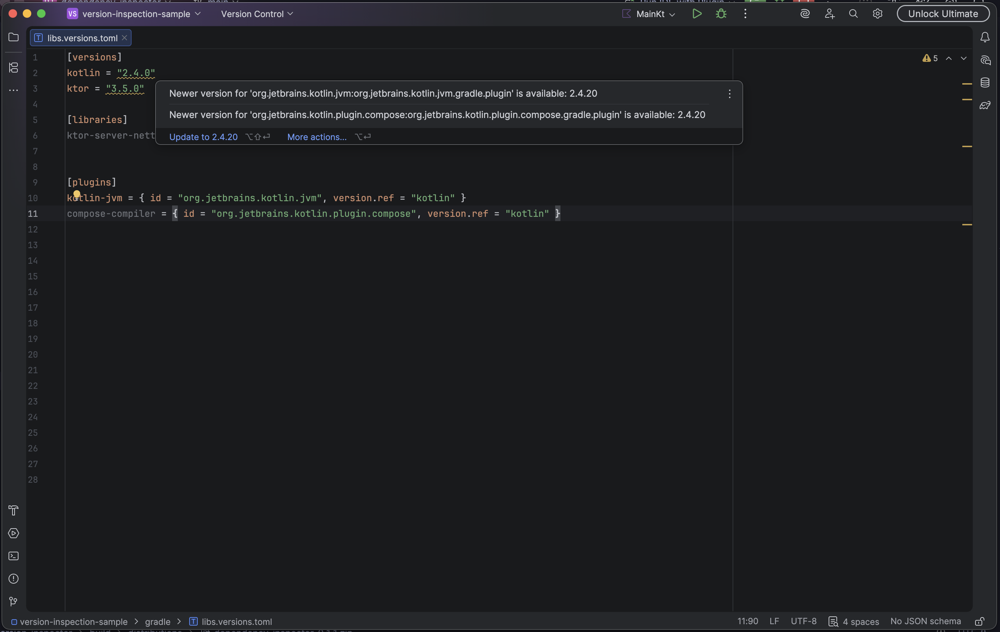

# Dependency Inspector

An IntelliJ IDEA plugin that detects outdated Gradle dependencies and provides quick fixes for updating them.

Dependency Inspector brings Android Lint-like dependency version inspections to non-Android Gradle projects.

## Features

- Inspects declared dependencies in project automatically
- Detects newer stable versions available
- Supports libraries and Gradle plugins
- Supports direct versions `version` and shared versions using `version.ref` in Gradle Version Catalogs.
- Highlights outdated versions directly in the editor
- Provides quick fixes for updating versions
- Resolves versions asynchronously without blocking IDE inspections
- Uses project-level caching to avoid unnecessary repository requests

## Current state

Currently supports only dependencies declared in Gradle Version Catalog and which are available on Maven Central.
Support for Maven POMs, Gradle Kotlin/Groovy dependencies hard-coded in strings, and other repositories, such as Google
Maven or Gradle Plugin Portal, is planned in the future.

## Example

